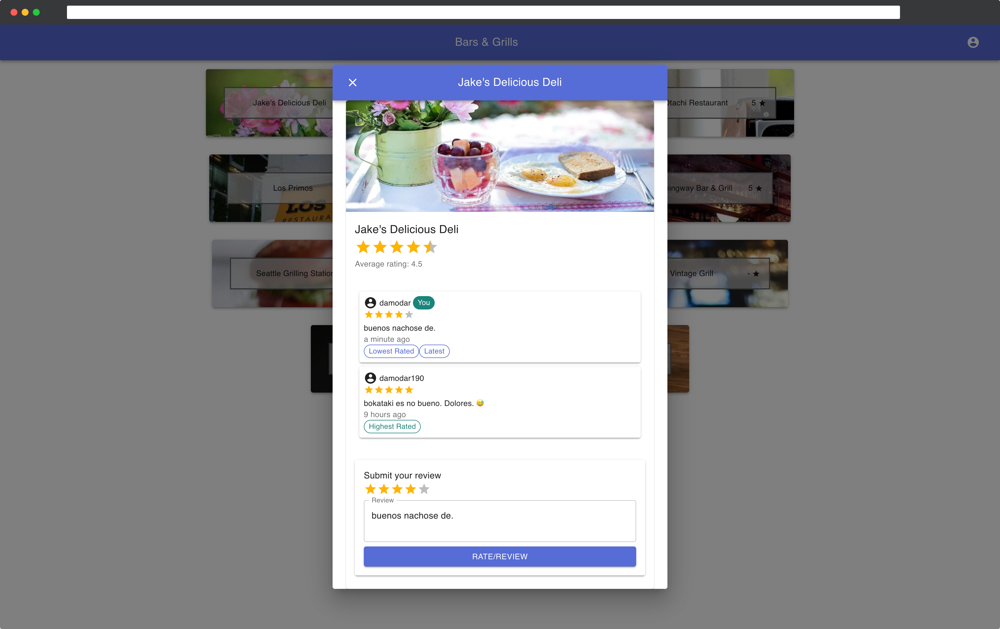

# Bars and Grills (Restaurant App)

A sample web solution which allows users to review restaurants, featuring:

* A multi-project React app for a responsive mobile-first frontend ("webapp"), and an admin-panel (React-Admin)
* A Python/Django RESTful API running using a postgres database (on AWS RDS)
* Amazon Web Services hosting components on Elastic Container Service
* Continuous Integration (CI) using CircleCI and Continous Deployment (CD) using AWS CodePipeline

Project homepage: [bng.damodar.dev](https://bng.damodar.dev)\
Frontend: [app.bng.damodar.dev](https://app.bng.damodar.dev)\
Admin-Panel: [admin.bng.damodar.dev](https://admin.bng.damodar.dev)\
Django API: [api.bng.damodar.dev](https://api.bng.damodar.dev) ([Swagger specs](api.bng.damodar.dev/swagger))

## React projects
* A multi-project create-react-app for mobile-first frontend ("webapp"), and an admin-panel (React-Admin)
* Responsive Material UI with pixel-perfect designs
* Strong typing using TypeScript and `eslint`
* React Hooks
* The two projects hosted as isolated docker containers in ECS

## Django backend
* Role based authentication using JWT for stateless paginated RESTful API calls
* [Swagger specifications](api.bng.damodar.dev/swagger)
* [Postman routes](https://www.getpostman.com/collections/ddc8f21db248ec42dd03)

## AWS Cloud Architecture
* Partially set up using Terraform (will convert into full setup soon)
* CodePipeline to:
  * Automatically trigger build on pushing source code in CodeCommit
  * Build docker containers for webapp, admin-panel and api and push them to ECR
* All resources running on a private cloud (VPC)
* Route53 hosted at zone `bng.damodar.dev`
* Certificates managed through ACM

## License
Free and open source software (FOSS) licensed using the [MIT License](./LICENSE.txt).

## Contributors
This project was created by Damodar Dahal <hi@damodar.dev>. All pull requests and issues are welcome.
