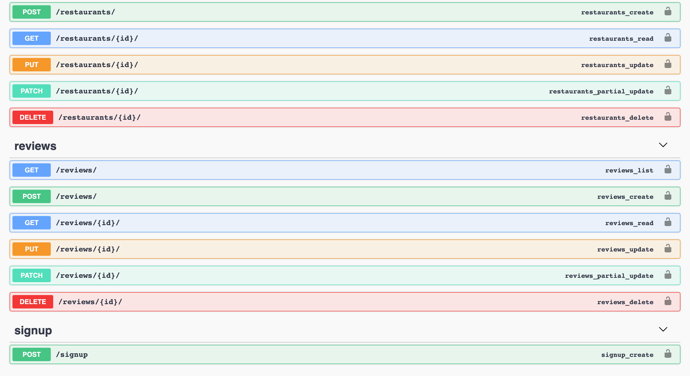

# Bars and Grills (Restaurant App)

This app will show restaurants for the user and allow them to rate/review the restaurants.

It contains the following components:
* Django REST API (located in `backend/`)
* React "webapp" (located in `app/src/webapp`)
* React-Admin admin panel (located in `app/src/admin-panel`)

## Screenshots
All screenshots are placed in `./screenshots` directory. Select screenshots are shown below:
### Webapp

### Admin panel

### API
Screenshot of Swagger definitions:

## Features
* Responsive, pixel-perfect Material UI design
* CRUD API with Pagination
* Role-based authentications using JWT
* React Hooks
* TypeScript types
* Unit and e2e tests
* Swagger Dashboard for API
* Django unit tests

## License
See [LICENSE](./LICENSE) file.

## Contributors
This project was setup by Damodar Dahal <hi@damodar.dev>. Thank you for browsing!
